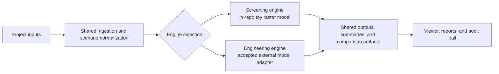
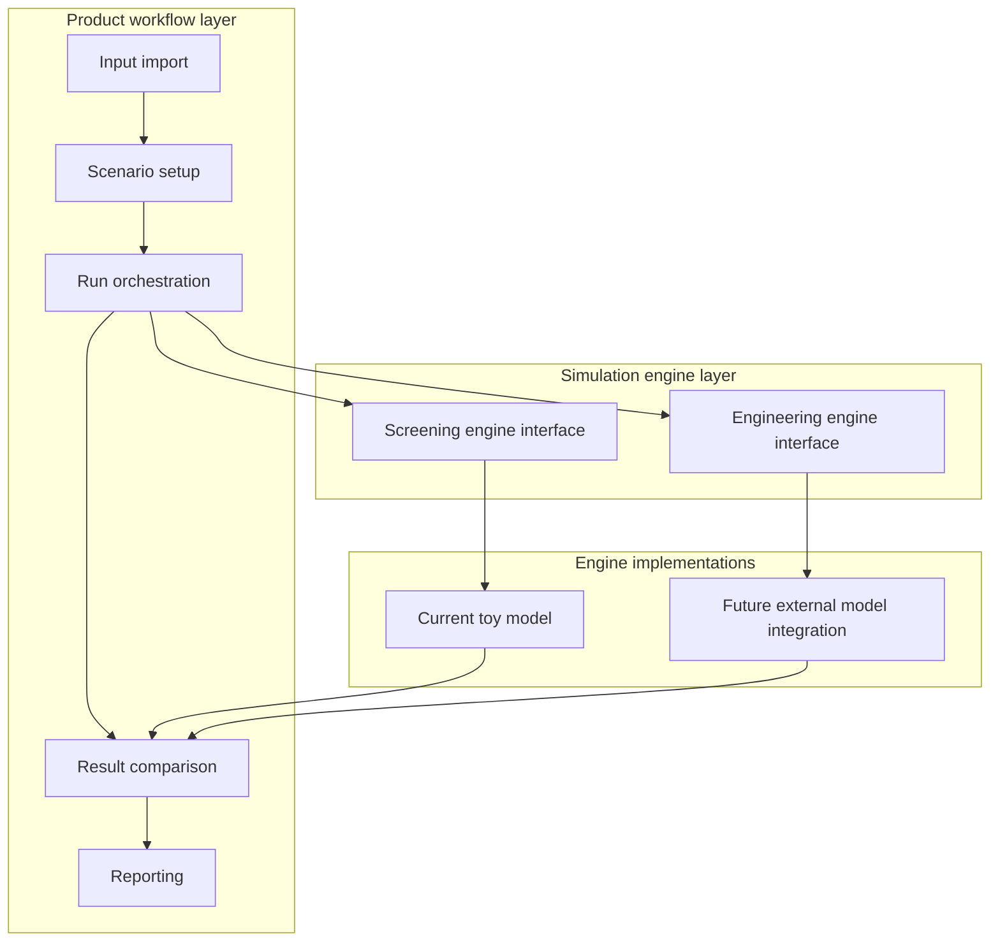

# Architecture

FloodSim is planned as a pipeline with clear boundaries between data preparation, simulation, and visualization.

## Planned flow

`data ingestion -> simulation core -> output raster/tiles -> graphical visualization`

## Components

### 1. Data ingestion

The ingestion layer will prepare terrain and scenario inputs:

- DEM and GeoTIFF terrain loading
- raster normalization and clipping
- scenario metadata such as rainfall intensity and duration

The build now supports optional GDAL integration as the intended path for the first real DEM and GeoTIFF ingestion work. That support should stay narrow in the early Phase 2 implementation: one-band terrain rasters first, broader GIS workflows later.

For the first real-terrain workflow, ingestion should target the contract described in [docs/terrain_ingestion_contract.md](/home/sergio/dev/flood-sim/docs/terrain_ingestion_contract.md). That contract keeps the initial imported terrain object narrow: raster dimensions, square cell size, row-major elevations, a valid-cell mask for nodata handling, and optional origin / CRS metadata preserved for later map alignment.

Terrain clipping is now an explicit ingestion-layer capability rather than only
an example-CLI convenience. Callers can request either the full source raster
or a bounded pixel window and still receive the same validated `TerrainRaster`
contract.

When inspection or debugging matters, the same ingestion path can also return a
separate `TerrainIngestionReport` describing nodata metadata presence,
valid-domain counts, and clipping loss without changing the simulation-facing
terrain contract.

The contract-to-simulation handoff is explicit as well: validated
`TerrainRaster` data is adapted into `Grid` through a dedicated core helper so
examples and future ingestion tools do not each reimplement that mapping.
The real-terrain example now treats rainfall and timing inputs similarly by
building one narrow scenario configuration object before constructing the
simulation-facing rainfall and step settings. That workflow logic now lives in
a small example-support C++ layer rather than in `main()`, so parsing,
validation, execution, reporting, and export orchestration can be tested
without pushing those concerns into the simulation kernel.
That same example support layer now also accepts one tiny CSV scenario-file
contract with a fixed header and one row per scenario. The format is
intentionally narrow and local to the example workflow: it covers only the
stabilized scenario fields already present in `ScenarioConfig` and avoids
bringing in broader config-file tooling.
That contract can now describe either a constant-intensity rainfall event or a
profile-backed event through one referenced per-step rainfall CSV, while still
normalizing both paths into the same `ScenarioConfig` before execution.
The same support layer now also accepts one narrow surface-class CSV overlay so
reviewed terrain clips can distinguish simple pervious and impervious runoff
behavior without introducing a broader land-use subsystem.
Regression fixtures for that example live alongside the example assets and test
harness, not in the simulation-core interfaces. That keeps fixture identity,
test expectations, and smoke-case intent out of the engine configuration
surface while still making deterministic terrain cases reusable.

### 2. Simulation core

The simulation core is implemented in C++20 for deterministic behavior and future performance headroom.

Current responsibilities:

- store terrain elevation and water depth on a raster grid
- apply uniform rainfall before each flow step, with rainfall scenario intensity expressed in meters per hour and converted using `time_step_seconds`
- route a fraction of water to lower orthogonal neighbors using surface height (`elevation + water depth`)
- accumulate transfers across the full grid and apply them after the scan completes
- expose boundary handling as an explicit simulation setting, with support for closed boundaries plus one narrow open edge-outflow mode for clipped terrain
- treat invalid imported-terrain cells as out-of-domain cells that do not receive rainfall and cannot receive routed flow

Important public types:

- `Grid`: the simulation-state raster, including terrain elevation, ponded water depth, valid-cell mask, and remaining event-start loss per cell
- `RainfallScenario`: one uniform rainfall pulse passed into a single step
- `SimulationConfig`: time-step, runoff-loss, initial-loss, and boundary settings shared across steps
- `TerrainRaster`: validated imported terrain with dimensions, elevations, valid-cell mask, and optional origin / CRS metadata
- `LoadedTerrainRaster`: `TerrainRaster` plus a `TerrainIngestionReport` so ingestion diagnostics stay out of the simulation state itself
- `ScenarioConfig` in the real-terrain example: one normalized workflow scenario assembled from presets, files, and CLI overrides before the run starts
- `SurfaceClassConfig` in the real-terrain example: one narrow raster-aligned overlay describing impervious cells plus their runoff-loss settings

Later responsibilities may include:

- import-ready raster adapters
- additional boundary modes beyond the current open edge-outflow behavior
- drainage and impervious surface effects
- better time stepping and calibration hooks

## Target model architecture

The current repository should keep one explicit distinction in view:

- the in-repo toy model is a screening engine
- a later integrated accepted external model can serve as the engineering engine for more serious studies

That split supports a more credible product posture without pretending that the
current raster MVP is itself a certified or regulator-ready solver.

### Why separate engines

- The toy model is fast, transparent, deterministic, and easy to regression test.
- It is appropriate for product iteration, first-pass site screening, and UX development.
- A real engineering workflow usually needs a more established hydrology or hydraulics engine, plus the calibration, reporting, and review process that goes with it.
- Keeping those paths separate helps the product communicate confidence and intended use clearly.

### Target flow with multiple engines

### Target responsibility split

### Refactor direction

To support that target architecture, future refactoring should bias toward:

- a narrow engine-agnostic run contract shared by all execution paths
- shared ingestion, scenario normalization, and export logic above the engine boundary
- explicit engine metadata in outputs so users can tell whether a result came from screening or engineering mode
- preserving deterministic local fixtures for the screening engine even after an external engine path exists
- keeping regulatory or engineering claims attached to the selected engine and workflow evidence, not to the product UI alone

This would make the product more serious in a practical sense if it is done
carefully: the product can stay simple locally while also offering a path to
more defensible engineering workflows. It does not, by itself, make every
output certified or suitable for formal flood-risk assessment.

### 3. Output raster and tiles

Simulation outputs should eventually be exportable as:

- raster flood-depth layers
- tiled outputs for map display
- summary metrics for scenario comparison

The Phase 1 MVP now supports a minimal CSV export path for toy-grid runs, and the same contract is reused for the first real-terrain example. The current export format begins with metadata lines for:

- `floodsim_csv_version`
- `rows`
- `cols`
- `cell_size_m`

Terrain-derived exports may also include:

- `scenario_name`
- `boundary_mode`
- `rainfall_mode`
- `rainfall_profile_path`
- `rainfall_intensity_m_per_hour`
- `peak_rainfall_intensity_m_per_hour`
- `total_rainfall_depth_m`
- `runoff_coefficient`
- `initial_loss_m`
- `surface_class_file`
- `impervious_cell_count`
- `impervious_runoff_coefficient`
- `impervious_initial_loss_m`
- `time_step_seconds`
- `total_duration_seconds`
- `origin_x_m`
- `origin_y_m`
- `crs_id`

After the metadata preamble, the file writes one row per cell with:

- `row`
- `col`
- `elevation_m`
- `water_depth_m`
- `surface_height_m`

This keeps the output stable and self-describing for scripts or a future viewer without introducing heavier raster or GIS dependencies yet. The optional scenario, boundary, and timing fields let real-terrain runs carry enough run identity for safe comparison, while the optional origin / CRS fields preserve map placement metadata without changing the per-cell table layout.

For quick terminal-side review, the real-terrain example also emits a small
metrics summary derived from the current grid state, including wet-cell count,
maximum depth, and the deepest-cell location. That summary is intentionally a
lightweight comparison aid rather than a richer reporting artifact.

The same workflow can now also emit deterministic intermediate snapshot CSVs at
selected completed-step intervals. Those snapshots reuse the main per-cell CSV
contract and identify simulation time through deterministic filenames rather
than a separate time-series container.

The simulation-facing configuration now also includes a simple runoff
coefficient. In the current MVP this acts as a narrow rainfall-retention
control: it scales how much rainfall becomes immediate surface water before
routing. That is useful for practical screening, but it should not be confused
with a calibrated infiltration or subsurface model.

The same configuration now also includes `initial_loss_m`, a small event-start
abstraction control. In the current MVP it represents a fixed per-cell depth
that must be satisfied before rainfall appears as surface water. This improves
screening realism for short events, but it is still not a full infiltration,
soil-moisture, or drainage-process model.

The real-terrain example can now also load a narrow external rainfall-profile
CSV and replay one intensity per step. That is the first step toward more
realistic reviewed storm events without turning the repository into a broad
scenario scheduler.

The first real-terrain example workflow now lives in
[examples/real_terrain/README.md](/home/sergio/dev/flood-sim/examples/real_terrain/README.md:1).
It exercises the narrow GDAL ingestion path, imported-domain handling, the
existing simulation step, and CSV export together on a committed sample
GeoTIFF.

### 4. Graphical visualization

A future visualization layer can render flood depth over basemaps and city layers. This may begin as a lightweight local viewer and later evolve into a richer graphical application if the simulation outputs and workflows justify it. It is intentionally not included in the first version of this repository.

The repository now reserves `apps/native_viewer/` for that product-facing
local visualization path. The current scaffold is intentionally narrow: it
starts as a native raster/result inspection app boundary rather than as a full
GIS shell or simulation orchestrator.

## Technical paper artifact

The repository also carries a LaTeX paper describing the implemented Phase 1 simulator in `docs/paper/phase1_simulator.tex`.

That paper is intended to:

- describe the current toy-grid model as implemented
- capture rainfall, routing, boundary, and export assumptions in one place
- provide a compact technical artifact for review, presentation, and later extension

It should stay aligned with the actual code and tests rather than getting ahead of the implementation roadmap.
